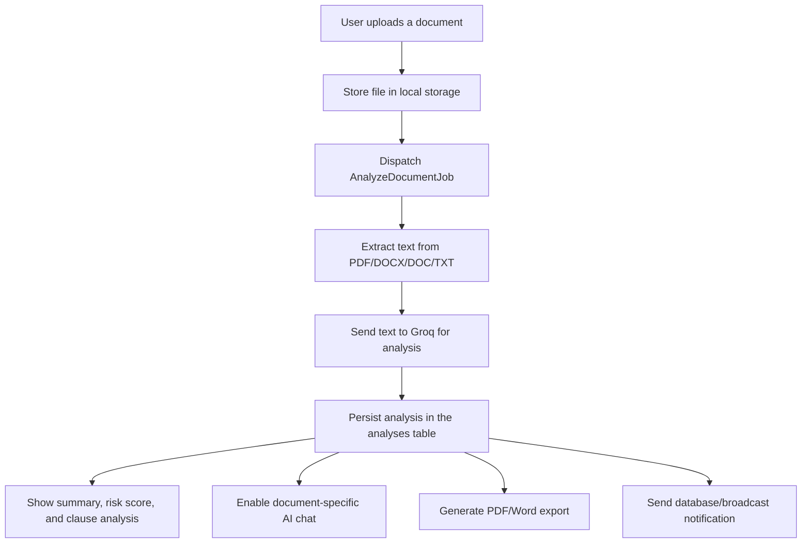

# AI Contract & Document Analyzer

A Laravel-based web application for uploading contracts and other documents, extracting their text, analyzing them with Groq, and presenting the results through a document workspace, AI chat, notifications, and report export features.

## What This App Actually Does

This project is a document analysis workflow for authenticated users. A user uploads a PDF, DOC, DOCX, or TXT file, the application stores the file, extracts text in a background job, sends that text to Groq for analysis, and then saves an analysis record with a summary, risk score, and clause-level analysis. The application also provides a document-specific AI chat that uses the extracted text as context, a global assistant chat, database/broadcast notifications, and PDF/Word report exports.

## Core Features

### AI-Powered Document Analysis (Groq)

The main analysis pipeline is implemented in the queued job [app/Jobs/AnalyzeDocumentJob.php](app/Jobs/AnalyzeDocumentJob.php) and the service [app/Services/GroqAnalysisService.php](app/Services/GroqAnalysisService.php).

When a document is uploaded through [app/Http/Controllers/DocumentController.php](app/Http/Controllers/DocumentController.php), the file is stored and a job is dispatched. The job reads the stored file, extracts text from PDF, DOCX/DOC, or TXT content, cleans the text, and sends it to Groq using the model `llama-3.3-70b-versatile`. The request is sent as a chat completion with a system prompt that requires the model to return a JSON object containing:

- `summary`
- `risk_score`
- `risk_distribution` with `Legal`, `Financial`, `Privacy`, and `Compliance` categories
- `critical_issues`
- `clauses_analysis`
- `ai_confidence`

The parsed result is persisted in the `analyses` table and linked to the document.

### Interactive AI Chatbot

There are two chat surfaces:

- A document-specific chat at `/intelligence/{document}/chat`, implemented by [app/Http/Controllers/AiChatController.php](app/Http/Controllers/AiChatController.php). It sends the user's question plus the document's extracted text to Groq using the model `openai/gpt-oss-20b` and expects a JSON response with `answer` and `quote`. Conversations are stored in the `ai_chats` table, and the response can include a source quote for highlighting in the document viewer.
- A floating global assistant in [resources/views/layouts/partials/global-chat.blade.php](resources/views/layouts/partials/global-chat.blade.php), backed by [app/Http/Controllers/GlobalAiChatController.php](app/Http/Controllers/GlobalAiChatController.php). This is not document-scoped; it sends the user's text to Groq as a general chat prompt. Unlike the document-specific chat, this assistant does **not** persist any conversation state — see Known Limitations below.

### Notifications

Notification classes are defined in [app/Notifications/ReportReadyNotification.php](app/Notifications/ReportReadyNotification.php), [app/Notifications/NewDeviceLoginNotification.php](app/Notifications/NewDeviceLoginNotification.php), and [app/Notifications/WelcomeNotification.php](app/Notifications/WelcomeNotification.php).

The implemented channels are:

- `database`
- `broadcast`

The current triggers are:

- A report is marked as ready after the analysis job finishes and the owner is notified.
- A new device login triggers a notification when the login IP/agent is first seen for that user.
- A welcome notification is sent when a user registers.

The notification endpoints are exposed in [routes/web.php](routes/web.php) at `/api/notifications` and `/api/notifications/read`. Despite the `/api/` prefix, these are standard web routes registered in `web.php` — they run through the `web` middleware group (session-based `auth`, CSRF-protected) rather than a token-based `api` middleware group. They are intended to be called from the same-origin frontend via `fetch`/`axios` with the session cookie, not as a public or externally consumable REST API.

### Report Generation & Export

The application can export a report in two formats:

- PDF export is implemented in [app/Http/Controllers/DocumentController.php](app/Http/Controllers/DocumentController.php) using `mPDF` via `Mpdf`. The export route is `/documents/{document}/export-pdf`.
- Word export is also implemented in the same controller using `PhpOffice\PhpWord` and `IOFactory`. The export route is `/documents/{document}/export-word`.

The generated export uses the latest analysis attached to the document and renders a summary-oriented report view for PDF output.

### Authentication, Document History, and Dashboard

The project uses Laravel's authentication stack with Breeze-style routes under [routes/auth.php](routes/auth.php). Authenticated users can:

- upload documents
- view document history
- inspect processing status and progress
- visit a document intelligence workspace
- see a dashboard with counts for total documents, high/medium/low risk analyses, and recent reports

## Tech Stack

### Backend

- PHP 8.3+
- Laravel Framework 13.8
- Laravel Breeze for authentication scaffolding
- Laravel Queue with a database-backed queue driver
- Laravel Reverb package is installed

### Frontend

- Blade templates
- Tailwind CSS
- Alpine.js
- Vite

### AI / Document Processing

- Groq API integration via `Illuminate\Support\Facades\Http`
- Primary analysis model: `llama-3.3-70b-versatile`
- Document-specific chat model: `openai/gpt-oss-20b`
- PDF text extraction via `spatie/pdf-to-text`
- DOCX/DOC parsing via `phpoffice/phpword`
- PDF export via `mpdf/mpdf`
- Word export via `phpoffice/phpword`
- The repository also includes `barryvdh/laravel-dompdf`, but the active export implementation in the current code uses `mPDF` rather than DOMPDF

### Data Store and Storage

- Default database connection in the example environment is SQLite
- Queue connection defaults to `database`
- File storage defaults to the local disk under `storage/app/private`

## Architecture Overview

The current implementation follows this flow:



## Installation & Setup

This project is a standard Laravel application. The repository includes Composer and NPM scripts that reflect the intended local workflow.

1. Clone the repository and enter the project directory.
2. Install PHP dependencies:

```bash
   composer install
```

3. Install frontend dependencies:

```bash
   npm install
```

4. Copy the example environment file and set the required values:

```bash
   cp .env.example .env
   php artisan key:generate
```

5. Add the Groq API key to `.env`:

```env
   GROQ_API_KEY=your_groq_api_key
```

6. Configure the database and queue settings in `.env` if needed. The example file defaults to SQLite and a database-backed queue.

7. Run migrations:

```bash
   php artisan migrate
```

8. Create a storage link if you want public assets served from storage:

```bash
   php artisan storage:link
```

9. Start the queue worker for background analysis:

```bash
   php artisan queue:listen --tries=1 --timeout=0
```

10. Start the application and frontend build tools:

```bash
   php artisan serve
   npm run dev
```

The repository also provides a convenience script in `composer.json` for setup and development.

## Usage

1. Sign up or log in.
2. Upload a supported document (`pdf`, `doc`, `docx`, or `txt`).
3. Wait for the queued analysis job to finish. The document status moves from `pending` to `processing` to `done`.
4. Open the intelligence view for the document to see the extracted text, summary, risk score, and clause analysis.
5. Use the document chat to ask questions about the uploaded file. The chat uses the document text as context.
6. Download the PDF or Word report from the document workflow.

## Environment Variables

The example environment file defines the following variables:

| Variable | Description |
| --- | --- |
| `APP_NAME` | Application name used by Laravel and related services. |
| `APP_ENV` | Runtime environment, typically `local` or `production`. |
| `APP_KEY` | Laravel application encryption key. |
| `APP_DEBUG` | Enables or disables verbose debug output. |
| `APP_URL` | Base URL used by the application. |
| `DB_CONNECTION` | Database driver. The example file defaults to SQLite. |
| `DB_HOST`, `DB_PORT`, `DB_DATABASE`, `DB_USERNAME`, `DB_PASSWORD` | Database connection settings for non-SQLite deployments. |
| `SESSION_DRIVER` | Session storage driver. |
| `BROADCAST_CONNECTION` | Broadcast driver used by the notification layer. |
| `FILESYSTEM_DISK` | Default storage disk. The current config defaults to `local`. |
| `QUEUE_CONNECTION` | Queue driver. The example file uses `database`. |
| `CACHE_STORE` | Cache backend. |
| `MAIL_MAILER`, `MAIL_HOST`, `MAIL_PORT`, `MAIL_USERNAME`, `MAIL_PASSWORD` | Mail configuration values. |
| `AWS_ACCESS_KEY_ID`, `AWS_SECRET_ACCESS_KEY`, `AWS_DEFAULT_REGION`, `AWS_BUCKET` | Optional S3-compatible storage configuration. |
| `VITE_APP_NAME` | Vite application name. |

Additional variable required by the current code path:

| Variable | Description |
| --- | --- |
| `GROQ_API_KEY` | Required for the Groq-based document analysis and chat endpoints. This is read by the application configuration in `config/services.php` but is not present in the shipped `.env.example` file. |

## Known Limitations / Not Yet Implemented

- The project is primarily a web application with a few inline JSON endpoints for notifications and chat; there is no clearly defined REST API layer in the repository beyond those routes.
- The active analysis pipeline uses Groq. A separate `GeminiAnalysisService` class exists in the codebase, but it is not wired into the main upload/analysis flow.
- Some export and UI code references fields such as `counterparty`, `exposure`, `clauses_count`, `key_risks`, and `recommendations`, but the current analysis migration/model does not persist those fields. The generated export therefore depends on the values that are actually available in the current analysis model.
- The application stores files locally by default. S3 support is configured in the filesystem settings, but the current upload flow does not switch the default disk to S3.
- The user model has a `role` field, but the repository does not show a complete admin-only UI or permission system implemented around it.
- **The Global AI Assistant (`GlobalAiChatController`) does not persist chat history anywhere** — not in the database, and not in the session. Each message is sent to Groq independently with no prior conversation context, and the entire conversation is lost on page refresh. This should not be described as having conversation memory. If persistent, multi-turn context is desired for this assistant, it would require a dedicated table (e.g. `global_chat_messages`) or, at minimum, session-based storage.
- **The `/search/live` route is not protected by the `auth` middleware**, unlike every other document, settings, and intelligence route in the application, which are wrapped in `Route::middleware('auth')->group(...)`. If public, unauthenticated search is intentional, no action is needed; otherwise this route should be moved inside an `auth` middleware group to match the rest of the application's access pattern.
- **The `/api/notifications` and `/api/notifications/read` endpoints are named with an `/api/` prefix but are not a real token-based API.** They are defined in `routes/web.php`, run through the standard `web` middleware group, and rely on the authenticated session cookie rather than an API token (e.g. Sanctum). They work correctly for same-origin `fetch`/`axios` calls from the app's own frontend, but they are not suitable for external consumption (e.g. a mobile app or third-party integration) without further work.